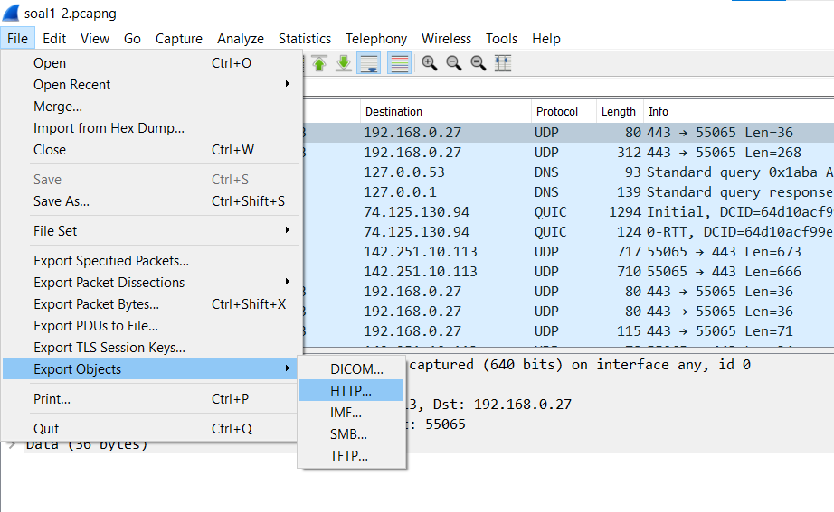
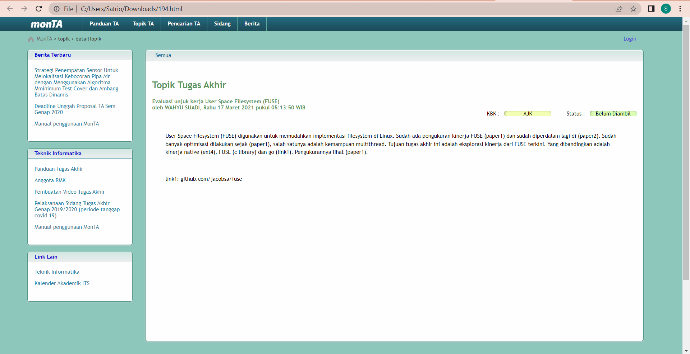

# Jarkom-Modul-1-ITB09-2022
Laporan Resmi Praktikum Jaringan Komunikasi Modul 1

## Soal 2
Ishaq sedang bingung mencari topik ta untuk semester ini , lalu ia datang ke website monta dan menemukan detail topik pada website “monta.if.its.ac.id” , judul TA apa yang dibuka oleh ishaq ?

### Cara Pengerjaan
1. Pertama-tama kita buka file pcapng yang sudah diberikan di soal. Selanjutnya kita klik export object yang menggunakan protokol **HTTP**.

2. Cari paket yang diminta sesuai dengan soal (Detail Topik). Jika sudah ketemu, pilih opsi untuk *save* paket dengan jenis file `.html` (Agar bisa dibuka di browser).

3. Buka file yang sudah di simpan dengan browser. Jika di cek, maka kita akan tahu topik TA yang sedang dicari oleh Ishaq (FUSE).

