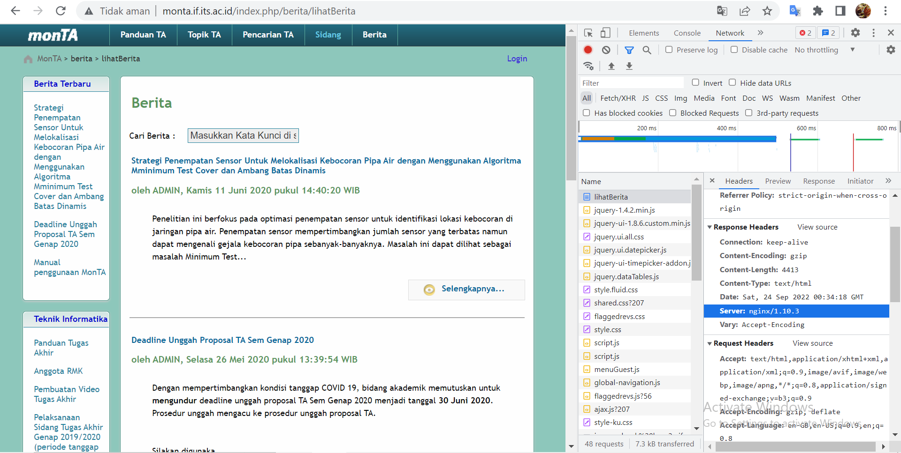
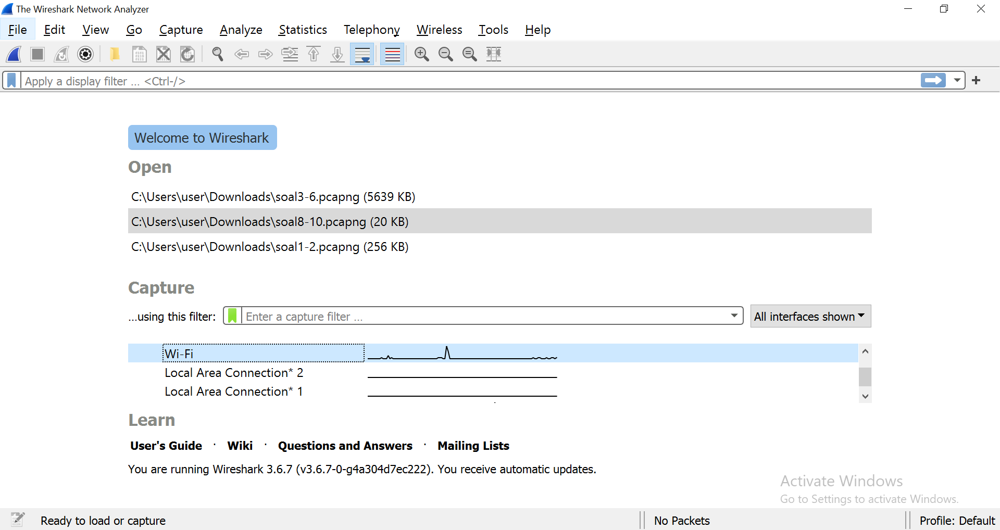

# Jarkom-Modul-1-ITB09-2022
Laporan Resmi Praktikum Jaringan Komunikasi Modul 1

---

## Anggota Kelompok
Nama | NRP
--- | ---
Rama Muhammad Murshal | 5027201041
Satrio Kamil Widhiwoso | 5027201051

## Daftar Isi
- [Soal 1](#soal-1)
- [Soal 2](#soal-2)
- [Soal 3](#soal-3)
- [Soal 4](#soal-4)
- [Soal 5](#soal-5)
- [Soal 6](#soal-6)
- [Soal 7](#soal-7)
- [Soal 8](#soal-8)
- [Soal 9](#soal-9)
- [Soal 10](#soal-10)

---

## Soal 1
Sebutkan web server yang digunakan pada "monta.if.its.ac.id"! 

### Cara Pengerjaan
1. Buka web `monta.if.its.ac.id`.
2. Buka developer tools, buka tab `Network`.
3. Refresh halaman.
4. Klik salah satu paket yang dikirimkan, lihat `Headers` kemudian `Response Headers`. 
5. Salah satu data yang dikirimkan mengandung dari web server mana dokumen ini, yakni dari `nginx/1.10.3`.


---

## Soal 2
Ishaq sedang bingung mencari topik ta untuk semester ini , lalu ia datang ke website monta dan menemukan detail topik pada website “monta.if.its.ac.id” , judul TA apa yang dibuka oleh ishaq ?

### Cara Pengerjaan
1. Pertama-tama kita buka file pcapng yang sudah diberikan di soal. Selanjutnya kita klik export object yang menggunakan protokol **HTTP**.


2. Cari paket yang diminta sesuai dengan soal (Detail Topik). Jika sudah ketemu, pilih opsi untuk *save* paket dengan jenis file `.html` (Agar bisa dibuka di browser).

3. Buka file yang sudah di simpan dengan browser. Jika di cek, maka kita akan tahu topik TA yang sedang dicari oleh Ishaq (FUSE).


---

## Soal 3
Filter sehingga wireshark hanya menampilkan paket yang menuju port 80! 

### Cara Pengerjaan
1. Pertama-tama kita buka file pcapng yang sudah diberikan di soal. 
2. Kemudian ketikkan command:
```
tcp.dstport == 80
```


---

## Soal 4
Filter sehingga wireshark hanya mengambil paket yang berasal dari port 21!

### Cara Pengerjaan
1. Pertama-tama kita buka file pcapng yang sudah diberikan di soal. 

2. Karena yang diminta adalah paket yang berasal dari port, maka commandnya adalah **`source`** atau **`src`**.

3. Yang diminta adalah port 21 **(TCP)**. Maka command nya adalah 
```
tcp.srcport==21
```


---

## Soal 5
Filter sehingga wireshark hanya mengambil paket yang berasal dari port 443!

### Cara Pengerjaan
1. Pertama-tama kita buka file pcapng yang sudah diberikan di soal. 
2. Kemudian ketikkan command:
```
tcp.srcport == 443
```


---

## Soal 6
Filter sehingga wireshark hanya menampilkan paket yang menuju ke `lipi.go.id` !

### Cara Pengerjaan
1. Pertama-tama, kita harus ping `lipi.go.id` untuk menemukan IP address dari web tersebut.


2. Lalu buka file .pcapng yang sudah diberikan.

3. Karena yang diminta paket yang menuju ke web, maka command yang akan kita pakai adalah `destination` atau `dst`.

4. Masukkan command 
```
ip.dst == 203.160.128.158
```


---

## Soal 7
Filter sehingga wireshark hanya mengambil paket yang berasal dari ip kalian!

### Cara Pengerjaan
1. Cek IP dengan menggunakan command `ipconfig` pada terminal, terdapat pada IPv4 Address.

2. Buka wireshark, lalu gunakan capture filter untuk Wi-Fi.

3. Masukkan command:
```
ip.src == 192.168.43.234
```


---

## Instruksi Soal 8-10
Di sebuah planet bernama Viltrumite, terdapat Kementerian Komunikasi dan Informatika yang baru saja menetapkan kebijakan baru. Dalam kebijakan baru tersebut, pemerintah dapat mengakses data pribadi masyarakat secara bebas jika memang dibutuhkan, baik dengan maupun tanpa persetujuan pihak yang bersangkutan. Sebagai mahasiswa yang sedang melaksanakan program magang di kementerian tersebut, kalian mendapat tugas berupa penyadapan percakapan mahasiswa yang diduga melakukan tindak kecurangan dalam kegiatan Praktikum Komunikasi Data dan Jaringan Komputer 2022. Selain itu, terdapat sebuah password rahasia (flag) yang diduga merupakan milik sebuah organisasi bawah tanah yang selama ini tidak sejalan dengan pemerintahan Planet Viltrumite. Tunggu apa lagi, segera kerjakan tugas magang tersebut agar kalian bisa mendapatkan pujian serta kenaikan jabatan di kementerian tersebut!

## Soal 8
Telusuri aliran paket dalam file .pcap yang diberikan, cari informasi berguna berupa percakapan antara dua mahasiswa terkait tindakan kecurangan pada kegiatan praktikum. Percakapan tersebut dilaporkan menggunakan protokol jaringan dengan tingkat keandalan yang tinggi dalam pertukaran datanya sehingga kalian perlu menerapkan filter dengan protokol yang tersebut.

### Cara Pengerjaan
1. Pertama-tama kita buka file pcapng yang sudah diberikan di soal. 

2. Lalu kita cek apakah ada paket yang berisi potongan percakapan. Jika kita lihat seksama, ada potongan percakapan antara **port 65432** dan **port 60236**.


3. Coba terapkan filter untuk melihat paket yang berasal dan menuju **port 65432** dengan command 
```
tcp.port==65432
```

4. Lalu klik kanan dan klik **Follow** dan pilih opsi **TCP Stream**. Maka akan tampil percakapan antara **port 65432** dan **port 60236**.


---

## Soal 9
Terdapat laporan adanya pertukaran file yang dilakukan oleh kedua mahasiswa dalam percakapan yang diperoleh, carilah file yang dimaksud! Untuk memudahkan laporan kepada atasan, beri nama file yang ditemukan dengan format **[nama_kelompok].des3** dan simpan output file dengan nama **“flag.txt”**.

### Cara Pengerjaan
1. Berdasarkan percakapan yang ada, diberitahu bahwa file akan dikirimkna melalui 9002, atau melalui port 9002.

2. Sehingga, pada file pcapng yang telah dibuka, kita masukkan command:
```
tcp.port == 9002
```


3. Klik kanan pada salah satu paket yang telah di-filter, klik Follow, klik TCP Stream. Sehingga muncul sebuah string yang mengindikasikan isi dari sebuah file.

---

## Soal 10
Temukan password rahasia (flag) dari organisasi bawah tanah yang disebutkan di atas!

### Cara pengerjaan
1. Kalau kita lihat dari percakapan yang telah ditemukan pada soal nomor 8, ada clue mengenai password untuk mendekripsi file yang kita temukan di nomor 9. **"passwordnya itu pake nama karakter anime yang kembar lima itu lho, jangan lupa pake huruf kecil semua"**.

2. Kalau kita cari nama karakter anime kembar 5 yang dimaksud, ada satu nama yang dimiliki oleh 5 kembar tersebut. Yaitu nama keluarga mereka **nakano**.

3. Setelah itu, kita coba dekripsi file tersebut dengan openssl dengan cara des3 di linux. Masukkan command 
```
openssl des3 -d -in [nama_kelompok].des3 -out flag.txt
```

4. Masukkan password yang kita temukan **(nakano)**, setelah itu akan kita temukan flagnya yaitu 
```
JaRkOm2022{8uK4N_CtF_k0k_h3h3h3}
```


---

## Thanks!